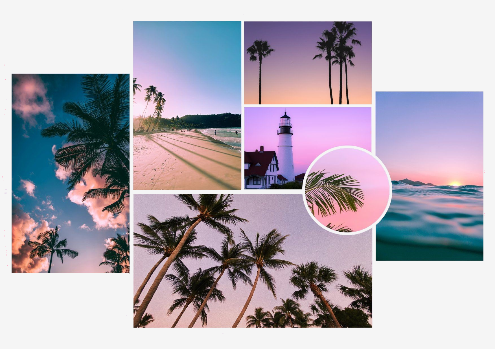

# ♾️ Infinite Scroll

> A sleek, infinite-scrolling image gallery powered by the **Unsplash API**. Scroll endlessly and discover stunning photography — seamless, fast, and beautiful.

---

## ✨ Features

- **Infinite Scrolling** — Images load automatically as you scroll down.
- **Unsplash Integration** — Fetches high-quality random photos from the Unsplash API.
- **Custom Cursor** — A sleek custom cursor with a blend-mode effect for a modern feel.
- **Animated Header** — Eye-catching ball animation and text reveal on load.
- **Loading Indicator** — Visual feedback while images are being fetched.
- **Error Handling** — Gracefully handles API rate limits and network errors.
- **Responsive Design** — Optimized for desktop, tablet, and mobile.
- **GitHub Corner Badge** — Quick link to the source code.

---

## 🚀 Live Demo

[](https://harshxindian.github.io/infinity-Scroll-Website/)

---

## 📸 Screenshots

|                  Header Section                  |                 Gallery View                 |
| :----------------------------------------------: | :------------------------------------------: |
|  | _(Scroll down to see the gallery in action)_ |

---

## 🛠️ Technologies Used

| Technology               | Purpose                                    |
| :----------------------- | :----------------------------------------- |
| **HTML5**                | Structure & semantics                      |
| **CSS3**                 | Styling, animations, responsive layout     |
| **JavaScript (Vanilla)** | Fetch API, DOM manipulation, scroll events |
| **Unsplash API**         | Random image source                        |
| **Google Fonts (Lato)**  | Typography                                 |
| **Font Awesome 6**       | Icon library (optional future use)         |

---

## 📦 How to Run Locally

### Prerequisites

- A modern web browser (Chrome, Firefox, Edge, etc.)
- [Node.js](https://nodejs.org/) (optional, only if you want to install dependencies)

### Steps

1. **Clone the repository**

   ```bash
   git clone https://harshxindian.github.io/infinity-Scroll-Website.git
   cd infinity-scroll
   ```

2. **Install dependencies** (optional — for Font Awesome icons)

   ```bash
   npm install
   ```

3. **Open in browser**

   Just open `index.html` in your favorite browser.

   > **Note:** The Unsplash API key is embedded in the script for demo purposes. For production, consider using your own API key from [Unsplash Developers](https://unsplash.com/developers).

---

## 🔑 API Reference

This project uses the **[Unsplash API](https://unsplash.com/developers)** to fetch random images.

- **Endpoint:** `https://api.unsplash.com/photos/random`
- **Method:** `GET`
- **Parameters:**
  - `client_id` — Your Unsplash API access key
  - `count` — Number of images per request (default: `30`)

To use your own API key, replace the `KEY` variable in `src/js/script.js`:

```js
const KEY = `your_unsplash_api_key_here`;
```

---

## 🤝 Contributing

Contributions, issues, and feature requests are welcome!  
Feel free to check the [issues page](https://harshxindian.github.io/infinity-Scroll-Website/issues).

---

## 🙌 Author

**Harsh** — Full Stack Developer & UI/UX Enthusiast

[](https://harshxindian.github.io/Harsh_Indian/)
[](https://github.com/harshxindian)

---

## 📄 License

This project is [ISC](https://opensource.org/licenses/ISC) licensed.

---

⭐ **If you like this project, give it a star on GitHub!** ⭐
